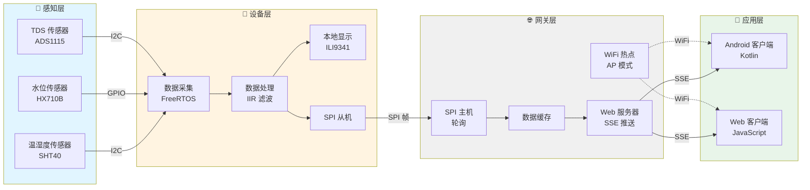
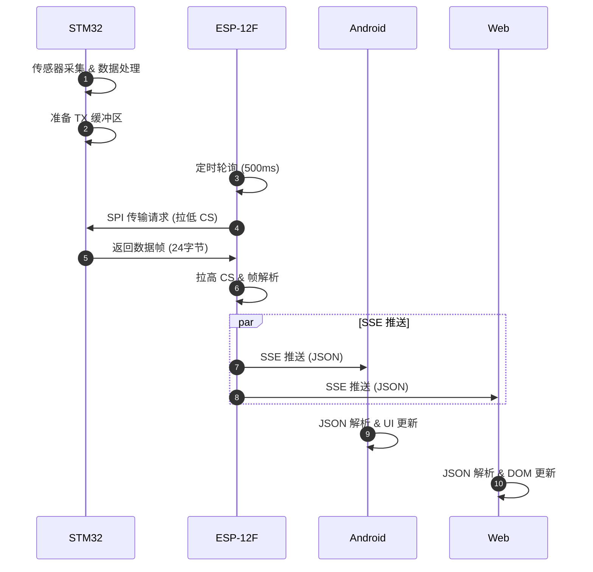

# 水质水位环境检测系统

基于 STM32 + ESP-12F + Android + Web 的端到端物联网水质监测系统，实现传感器数据采集、实时传输和多端可视化。

## 🏗️ 系统架构



### 子项目架构


| 端                   | 平台          | 架构模式                  | 核心职责                              |
| -------------------- | ------------- | ------------------------- | ------------------------------------- |
| WaterMonitor         | STM32F103ZET6 | 分层架构 + FreeRTOS       | 传感器数据采集、本地显示、SPI 通信    |
| WaterMonitor_ESP12F  | ESP-12F       | 四层架构                  | SPI 数据接收、WiFi 热点、SSE 实时推送 |
| WaterMonitor_Android | Android       | Clean Architecture + MVVM | SSE 客户端、数据处理、响应式 UI       |
| Web                  | Browser       | 原生 JavaScript           | SSE 客户端、实时数据展示、响应式设计  |

## 🔄 数据流转



### 通信协议

**SPI 数据帧格式** (24 字节)


| 字节  | 内容   | 类型      | 说明              |
| ----- | ------ | --------- | ----------------- |
| 0-1   | 帧头   | 0x55 0xAA | 固定帧头          |
| 2-5   | TDS    | float     | 水质 TDS 值 (ppm) |
| 6-9   | Level  | float     | 水位高度 (cm)     |
| 10-13 | Press  | float     | 压力值 (kPa)      |
| 14-17 | Temp   | float     | 温度 (°C)        |
| 18-21 | Humi   | float     | 湿度 (%)          |
| 22    | Status | uint8_t   | 系统状态          |
| 23    | CRC    | uint8_t   | 校验和            |

**SSE 数据格式**

```json
{
  "tds": 150.5,
  "level": 1.5,
  "press": 0.15,
  "temp": 25.3,
  "humi": 65.2,
  "status": 0
}
```

## 📦 技术栈

### STM32 设备端

**分层架构**: 应用层 → HAL 层 → 驱动层 → BSP 层


| 技术点       | 用途         | 关键特性                  |
| ------------ | ------------ | ------------------------- |
| FreeRTOS     | 实时操作系统 | 任务调度、互斥锁、信号量  |
| HAL 层设计   | 硬件抽象     | 统一接口、便于移植        |
| SPI 从机模式 | 设备间通信   | 被动响应、数据准备        |
| I2C 驱动     | 传感器通信   | ADS1115 ADC、SHT40 温湿度 |
| FSMC 接口    | LCD 显示     | ILI9341、240×320 分辨率  |

### STM32 编译

**工具链**: ARM Compiler 5 (AC5) V5.06 update 7 (build 960)

### ESP-12F 网关端

**分层架构**: 应用层 → 业务逻辑层 → 服务层 → HAL 层


| 技术点            | 用途     | 关键特性                         |
| ----------------- | -------- | -------------------------------- |
| Arduino Framework | 开发框架 | 快速开发、丰富生态               |
| SPI 主机模式      | 数据接收 | 主动轮询、时序控制               |
| SSE 推送          | 实时通信 | Server-Sent Events、多客户端支持 |
| WiFi AP 模式      | 热点创建 | 本地网络、无需路由器             |
| LittleFS          | 文件系统 | Web 资源存储、配置管理           |
| ArduinoJson       | 数据处理 | JSON 序列化、轻量级              |

### Android 客户端

**分层架构**: 表现层 → 领域层 → 平台层


| 技术点             | 用途      | 关键特性                         |
| ------------------ | --------- | -------------------------------- |
| Clean Architecture | 架构设计  | 依赖倒置、关注点分离             |
| MVVM               | UI 模式   | ViewModel、StateFlow、单向数据流 |
| Kotlin Coroutines  | 异步编程  | 协程、Flow、响应式流             |
| Jetpack Compose    | 声明式 UI | 现代化 UI、状态驱动              |
| Hilt               | 依赖注入  | 编译时注入、模块化               |
| OkHttp SSE         | 网络通信  | SSE 客户端、连接管理             |

### Web 客户端

**架构**: 原生 JavaScript + EventSource API


| 技术点          | 用途       | 关键特性                 |
| --------------- | ---------- | ------------------------ |
| EventSource API | SSE 客户端 | 浏览器原生支持、自动重连 |
| 原生 JavaScript | 业务逻辑   | 轻量级、无依赖           |
| DOM 操作        | UI 更新    | 实时数据渲染、状态指示   |
| CSS Flexbox     | 布局       | 响应式设计、移动端适配   |
| JSON.parse      | 数据解析   | 轻量级、原生支持         |

## 📁 项目结构

```
WaterMonitorProj/
├── WaterMonitor/              # STM32 设备端
│   ├── App/                   # 应用层
│   ├── HAL/                   # 硬件抽象层
│   ├── Driver/                # 驱动层
│   ├── BSP/                   # 板级支持包
│   ├── Start/                 # 启动文件
│   └── freeRTOS/              # FreeRTOS 内核
│
├── WaterMonitor_ESP12F/       # WiFi 网关端
│   ├── src/
│   │   ├── app/               # 应用层
│   │   ├── business/          # 业务逻辑层
│   │   ├── service/           # 服务层
│   │   └── hal/               # 硬件抽象层
│   └── web/                   # Web 客户端资源
│       ├── index.html         # 主页面
│       ├── admin.html         # 管理页面
│       ├── app.js             # 业务逻辑
│       └── style.css          # 样式文件
│
└── WaterMonitor_Android/      # 移动客户端
    ├── app/                   # 应用模块
    ├── domain/                # 业务领域层
    │   ├── sensor/            # 传感器模块
    │   ├── device/            # 设备模块
    │   └── system/            # 系统模块
    └── platform/              # 平台层
        ├── network/           # 网络模块
        └── compose/           # UI 组件
```

## 🔧 模块说明

### STM32 关键模块


| 模块            | 层级   | 职责                       |
| --------------- | ------ | -------------------------- |
| app_tds_task    | 应用层 | TDS 数据采集任务 (1s 周期) |
| app_water_task  | 应用层 | 水位数据采集任务 (1s 周期) |
| app_sht40_task  | 应用层 | 温湿度采集任务 (2s 周期)   |
| app_monitor     | 应用层 | 显示刷新任务 (0.5s 周期)   |
| hal_tds         | HAL 层 | TDS 传感器抽象接口         |
| hal_esp8266     | HAL 层 | ESP8266 通信抽象接口       |
| drv_ads1115     | 驱动层 | ADS1115 ADC 驱动           |
| drv_esp8266_spi | 驱动层 | ESP8266 SPI 通信驱动       |

### ESP-12F 关键模块


| 模块          | 层级       | 职责                  |
| ------------- | ---------- | --------------------- |
| SensorManager | 业务逻辑层 | 传感器数据管理        |
| SPI_Service   | 服务层     | SPI 数据接收与解析    |
| Cache_Service | 服务层     | 数据缓存管理          |
| Web_Service   | 服务层     | Web 服务器与 SSE 推送 |
| SPI_HAL       | HAL 层     | SPI 硬件操作封装      |
| WiFi_HAL      | HAL 层     | WiFi 热点管理         |

### Android 关键模块


| 模块             | 层级   | 职责               |
| ---------------- | ------ | ------------------ |
| MonitorViewModel | 表现层 | 监控页面状态管理   |
| SensorRepository | 领域层 | 传感器数据业务实现 |
| SseClient        | 平台层 | SSE 客户端实现     |
| MonitorScreen    | 表现层 | 监控页面 UI        |
| SensorService    | 领域层 | 传感器服务接口定义 |

### Web 关键模块


| 模块       | 文件       | 职责                 |
| ---------- | ---------- | -------------------- |
| SSE 客户端 | app.js     | EventSource 连接管理 |
| 数据解析   | app.js     | JSON 解析与数据提取  |
| UI 更新    | app.js     | DOM 元素实时更新     |
| 状态指示   | app.js     | 系统状态可视化       |
| 页面布局   | index.html | 响应式界面结构       |
| 样式设计   | style.css  | 卡片布局、进度条样式 |

## 📊 性能指标


| 指标         | 数值   | 说明                                 |
| ------------ | ------ | ------------------------------------ |
| 数据采集周期 | 1-2s   | 传感器采集频率                       |
| SPI 传输周期 | 500ms  | ESP12F 轮询间隔                      |
| SSE 推送延迟 | <100ms | 数据更新到推送延迟                   |
| 端到端延迟   | <1s    | 从采集到显示总延迟                   |
| SPI 帧大小   | 24字节 | 固定帧长度                           |
| SSE 客户端数 | ≤4    | 同时连接数限制（支持 Android + Web） |
